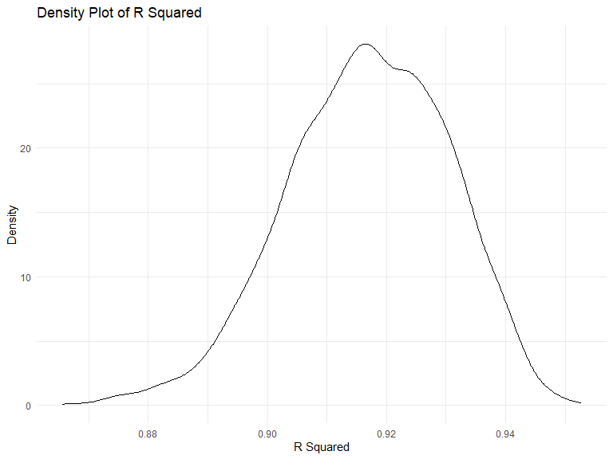
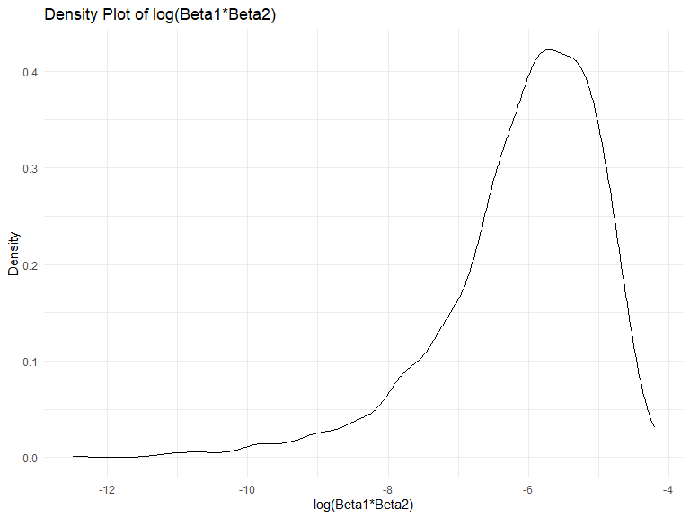
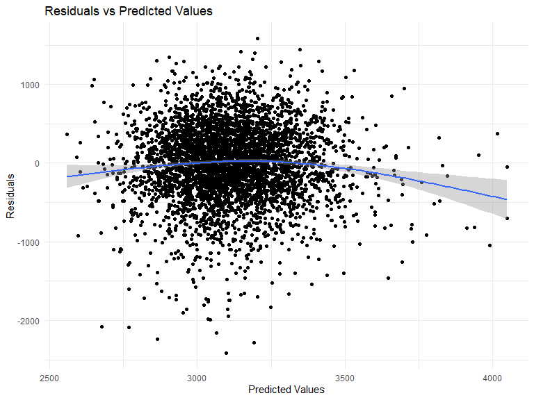
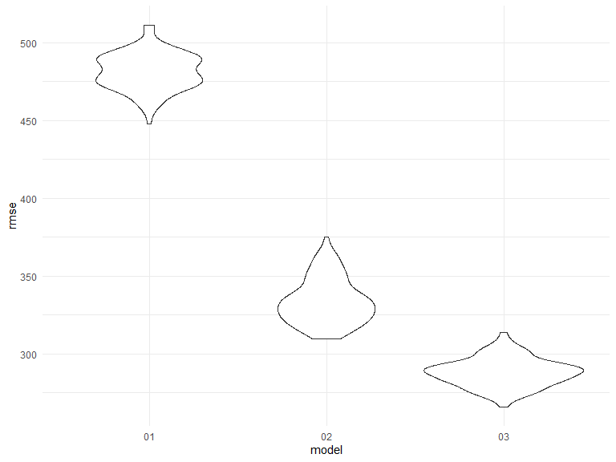

p8105_hw6_xs2529
================
Xinyi Shang
2023-11-30

### Problem 1

The data cleaning process involved creating new variables (`city_state`
and `resolution`), transforming `victim_age` to numeric, filtering
`victim_race` to white and black and filtering out specific cities.

``` r
homicide_df = 
  read_csv("data/homicide-data.csv", na = c("", "NA", "Unknown")) |> 
  mutate(
    city_state = str_c(city, state, sep = ", "),
    victim_age = as.numeric(victim_age),
    resolution = case_when(
      disposition == "Closed without arrest" ~ 0,
      disposition == "Open/No arrest"        ~ 0,
      disposition == "Closed by arrest"      ~ 1)
  ) |> 
  filter(victim_race %in% c("White", "Black")) |> 
  filter(!(city_state %in% c("Tulsa, AL", "Dallas, TX", "Phoenix, AZ", "Kansas City, MO"))) |> 
  select(city_state, resolution, victim_age, victim_sex, victim_race)
```

    ## Rows: 52179 Columns: 12
    ## ── Column specification ────────────────────────────────────────────────────────
    ## Delimiter: ","
    ## chr (8): uid, victim_last, victim_first, victim_race, victim_sex, city, stat...
    ## dbl (4): reported_date, victim_age, lat, lon
    ## 
    ## ℹ Use `spec()` to retrieve the full column specification for this data.
    ## ℹ Specify the column types or set `show_col_types = FALSE` to quiet this message.

Fit a logistic regression model using only data from Baltimore, MD.

``` r
baltimore_glm = 
  filter(homicide_df, city_state == "Baltimore, MD") |> 
  glm(resolution ~ victim_age + victim_sex + victim_race, family = binomial(), data = _)

baltimore_glm |> 
  broom::tidy() |> 
  mutate(
    OR = exp(estimate), 
    OR_CI_upper = exp(estimate + 1.96 * std.error),
    OR_CI_lower = exp(estimate - 1.96 * std.error)) |> 
  filter(term == "victim_sexMale") |> 
  select(OR, OR_CI_lower, OR_CI_upper) |>
  knitr::kable(digits = 3)
```

|    OR | OR_CI_lower | OR_CI_upper |
|------:|------------:|------------:|
| 0.426 |       0.325 |       0.558 |

Fit a model for each of the cities.

``` r
model_results = 
  homicide_df |> 
  nest(data = -city_state) |> 
  mutate(
    models = map(data, \(df) glm(resolution ~ victim_age + victim_sex + victim_race, 
                             family = binomial(), data = df)),
    tidy_models = map(models, broom::tidy)) |> 
  select(-models, -data) |> 
  unnest(cols = tidy_models) |> 
  mutate(
    OR = exp(estimate), 
    OR_CI_upper = exp(estimate + 1.96 * std.error),
    OR_CI_lower = exp(estimate - 1.96 * std.error)) |> 
  filter(term == "victim_sexMale") |> 
  select(city_state, OR, OR_CI_lower, OR_CI_upper)

model_results |>
  slice(1:5) |> 
  knitr::kable(digits = 3)
```

| city_state      |    OR | OR_CI_lower | OR_CI_upper |
|:----------------|------:|------------:|------------:|
| Albuquerque, NM | 1.767 |       0.831 |       3.761 |
| Atlanta, GA     | 1.000 |       0.684 |       1.463 |
| Baltimore, MD   | 0.426 |       0.325 |       0.558 |
| Baton Rouge, LA | 0.381 |       0.209 |       0.695 |
| Birmingham, AL  | 0.870 |       0.574 |       1.318 |

Generate a plot of the estimated ORs and CIs for each city, ordered by
magnitude of the OR from smallest to largest.

``` r
model_results |> 
  mutate(city_state = fct_reorder(city_state, OR)) |> 
  ggplot(aes(x = city_state, y = OR)) + 
  geom_point() + 
  geom_errorbar(aes(ymin = OR_CI_lower, ymax = OR_CI_upper)) + 
  theme(axis.text.x = element_text(angle = 90, hjust = 1))
```


Most cities show odds ratios below 1, indicating that crimes with male
victims have lower resolution odds compared to female victims after
adjusting for age and race. New York exhibits the strongest disparity.
In roughly half of these cities, confidence intervals are narrow and do
not contain 1, suggest a significant difference in resolution rates by
sex after adjusting for age and race.

### Problem 2

``` r
weather_df = 
  rnoaa::meteo_pull_monitors(
    c("USW00094728"),
    var = c("PRCP", "TMIN", "TMAX"), 
    date_min = "2022-01-01",
    date_max = "2022-12-31") |>
  mutate(
    name = recode(id, USW00094728 = "CentralPark_NY"),
    tmin = tmin / 10,
    tmax = tmax / 10) |>
  select(name, id, everything())
```

    ## using cached file: C:\Users\anna_\AppData\Local/R/cache/R/rnoaa/noaa_ghcnd/USW00094728.dly

    ## date created (size, mb): 2023-11-30 16:49:25.862309 (8.561)

    ## file min/max dates: 1869-01-01 / 2023-11-30

Generating bootstrap samples, fitting linear regression models (tmax ~
tmin + prcp), and storing the beta coefficients and r-squared values
from each model.

``` r
n_bootstrap = 5000
set.seed(1)

boot_sample = function(df) {
  sample_frac(df, replace = TRUE)
}

boot_straps = 
  tibble(strap_number = 1:n_bootstrap) |> 
  mutate(
    strap_sample = map(strap_number, \(i) boot_sample(df = weather_df))
  )

bootstrap_results = 
  boot_straps |> 
  mutate(
    models = map(strap_sample, \(weather_df) lm(tmax ~ tmin + prcp, data = weather_df) ),
    results_beta = map(models, broom::tidy),
    results_r_squared = map(models,broom::glance)
    ) |>
  select(-strap_sample, -models) 
```

Extracting $\hat{r}^2$ values and compute the 95% confidence interval.

``` r
r_squared = bootstrap_results |>
  unnest(results_r_squared) |>
  janitor::clean_names() |>
  select(r_squared)
  
r_squared_CI = r_squared |>
  summarize(
    ci_lower = quantile(r_squared, 0.025), 
    ci_upper = quantile(r_squared, 0.975))

r_squared_CI
```

    ## # A tibble: 1 × 2
    ##   ci_lower ci_upper
    ##      <dbl>    <dbl>
    ## 1    0.889    0.941

Extracting $\log(\hat{\beta}_1 \cdot \hat{\beta}_2)$ values and compute
the 95% confidence interval.

``` r
beta = bootstrap_results |>
  unnest(results_beta) |>
  janitor::clean_names() |>
  select (-results_r_squared) |>
  select(strap_number, term,estimate)|>
  pivot_wider(names_from = term, values_from = estimate) |>
  mutate(log_beta = log(tmin*prcp))
  
log_beta_CI = beta |> 
  drop_na() |>
  summarize(
    ci_lower = quantile(log_beta, 0.025), 
    ci_upper = quantile(log_beta, 0.975))

log_beta_CI
```

    ## # A tibble: 1 × 2
    ##   ci_lower ci_upper
    ##      <dbl>    <dbl>
    ## 1    -8.98    -4.60

Making density plot for $\hat{r}^2$ and
$\log(\hat{\beta}_1 \cdot \hat{\beta}_2)$.

``` r
ggplot(r_squared, aes(x = r_squared)) +
  geom_density() +
  ggtitle("Density Plot of R Squared") +
  xlab("R Squared") +
  ylab("Density")
```



The density plot of $\hat{r}^2$ shows a symmetrical, bell-shaped curve,
with the majority of data clustered around the center. It follows the
normal distribution.

``` r
ggplot(beta, aes(x = log_beta)) +
  geom_density() +
  ggtitle("Density Plot of log(Beta1*Beta2)") +
  xlab("log(Beta1*Beta2)") +
  ylab("Density")
```



The density plot of $\log(\hat{\beta}_1 \cdot \hat{\beta}_2)$ is
negatively skewed, suggests that the majority of values are concentrated
on the higher end, with a peak on the left, and there are some lower
values contributing to the longer left tail.

### Problem 3

``` r
birthweight = read_csv("data/birthweight.csv")|>
  janitor::clean_names()
```

    ## Rows: 4342 Columns: 20
    ## ── Column specification ────────────────────────────────────────────────────────
    ## Delimiter: ","
    ## dbl (20): babysex, bhead, blength, bwt, delwt, fincome, frace, gaweeks, malf...
    ## 
    ## ℹ Use `spec()` to retrieve the full column specification for this data.
    ## ℹ Specify the column types or set `show_col_types = FALSE` to quiet this message.

``` r
summary(birthweight)
```

    ##     babysex          bhead          blength           bwt           delwt      
    ##  Min.   :1.000   Min.   :21.00   Min.   :20.00   Min.   : 595   Min.   : 86.0  
    ##  1st Qu.:1.000   1st Qu.:33.00   1st Qu.:48.00   1st Qu.:2807   1st Qu.:131.0  
    ##  Median :1.000   Median :34.00   Median :50.00   Median :3132   Median :143.0  
    ##  Mean   :1.486   Mean   :33.65   Mean   :49.75   Mean   :3114   Mean   :145.6  
    ##  3rd Qu.:2.000   3rd Qu.:35.00   3rd Qu.:51.00   3rd Qu.:3459   3rd Qu.:157.0  
    ##  Max.   :2.000   Max.   :41.00   Max.   :63.00   Max.   :4791   Max.   :334.0  
    ##     fincome          frace          gaweeks         malform        
    ##  Min.   : 0.00   Min.   :1.000   Min.   :17.70   Min.   :0.000000  
    ##  1st Qu.:25.00   1st Qu.:1.000   1st Qu.:38.30   1st Qu.:0.000000  
    ##  Median :35.00   Median :2.000   Median :39.90   Median :0.000000  
    ##  Mean   :44.11   Mean   :1.655   Mean   :39.43   Mean   :0.003455  
    ##  3rd Qu.:65.00   3rd Qu.:2.000   3rd Qu.:41.10   3rd Qu.:0.000000  
    ##  Max.   :96.00   Max.   :8.000   Max.   :51.30   Max.   :1.000000  
    ##     menarche        mheight          momage         mrace      
    ##  Min.   : 0.00   Min.   :48.00   Min.   :12.0   Min.   :1.000  
    ##  1st Qu.:12.00   1st Qu.:62.00   1st Qu.:18.0   1st Qu.:1.000  
    ##  Median :12.00   Median :63.00   Median :20.0   Median :2.000  
    ##  Mean   :12.51   Mean   :63.49   Mean   :20.3   Mean   :1.627  
    ##  3rd Qu.:13.00   3rd Qu.:65.00   3rd Qu.:22.0   3rd Qu.:2.000  
    ##  Max.   :19.00   Max.   :77.00   Max.   :44.0   Max.   :4.000  
    ##      parity            pnumlbw     pnumsga      ppbmi            ppwt      
    ##  Min.   :0.000000   Min.   :0   Min.   :0   Min.   :13.07   Min.   : 70.0  
    ##  1st Qu.:0.000000   1st Qu.:0   1st Qu.:0   1st Qu.:19.53   1st Qu.:110.0  
    ##  Median :0.000000   Median :0   Median :0   Median :21.03   Median :120.0  
    ##  Mean   :0.002303   Mean   :0   Mean   :0   Mean   :21.57   Mean   :123.5  
    ##  3rd Qu.:0.000000   3rd Qu.:0   3rd Qu.:0   3rd Qu.:22.91   3rd Qu.:134.0  
    ##  Max.   :6.000000   Max.   :0   Max.   :0   Max.   :46.10   Max.   :287.0  
    ##      smoken           wtgain      
    ##  Min.   : 0.000   Min.   :-46.00  
    ##  1st Qu.: 0.000   1st Qu.: 15.00  
    ##  Median : 0.000   Median : 22.00  
    ##  Mean   : 4.145   Mean   : 22.08  
    ##  3rd Qu.: 5.000   3rd Qu.: 28.00  
    ##  Max.   :60.000   Max.   : 89.00

``` r
NA_birthweight = sum(is.na(birthweight))
NA_birthweight
```

    ## [1] 0

``` r
birthweight = birthweight |>
  mutate(babysex = as.factor(babysex)) |>
  mutate(malform = as.factor(malform)) |>
  mutate(frace = as.factor(frace)) |>
  mutate(mrace = as.factor(mrace))
```

In the process of data cleaning, I observed that there are no missing
values (NA) in the `birthweight` dataset. The dataset comprises 4342
observations and 20 variables, and the names are: babysex, bhead,
blength, bwt, delwt, fincome, frace, gaweeks, malform, menarche,
mheight, momage, mrace, parity, pnumlbw, pnumsga, ppbmi, ppwt, smoken,
wtgain. As part of the cleaning process, I converted the variables
`babysex`, `malform`, `frace`, and `mrace` into factors.

``` r
model <- lm(bwt ~ mheight + ppwt + ppbmi + delwt + wtgain, data = birthweight)

summary(model)
```

    ## 
    ## Call:
    ## lm(formula = bwt ~ mheight + ppwt + ppbmi + delwt + wtgain, data = birthweight)
    ## 
    ## Residuals:
    ##      Min       1Q   Median       3Q      Max 
    ## -2417.85  -280.30    23.83   311.42  1586.00 
    ## 
    ## Coefficients: (1 not defined because of singularities)
    ##               Estimate Std. Error t value Pr(>|t|)    
    ## (Intercept) -1582.4022  1154.1485  -1.371 0.170428    
    ## mheight        62.0980    18.1308   3.425 0.000621 ***
    ## ppwt          -18.1278     4.6035  -3.938 8.35e-05 ***
    ## ppbmi          58.7581    26.2524   2.238 0.025259 *  
    ## delwt          11.8511     0.6736  17.595  < 2e-16 ***
    ## wtgain              NA         NA      NA       NA    
    ## ---
    ## Signif. codes:  0 '***' 0.001 '**' 0.01 '*' 0.05 '.' 0.1 ' ' 1
    ## 
    ## Residual standard error: 482.4 on 4337 degrees of freedom
    ## Multiple R-squared:  0.1136, Adjusted R-squared:  0.1128 
    ## F-statistic:   139 on 4 and 4337 DF,  p-value: < 2.2e-16

I hypothesized that mother’s size, including weight and height, are
important in determining baby’s weight. So, I included mom’s height
`mheight`, mom’s pre-pregnancy weight `ppwt`, mom’s pre pregnancy bmi
`ppbmi`, mother’s weight at delivery (pounds) `delwt`, and mother’s
weight gain during pregnancy (pounds) `wtgain` into the model.

``` r
birthweight = birthweight |>
  add_predictions(model) |>
  add_residuals(model)
birthweight|>
  ggplot(aes(x = pred, y = resid)) +
  geom_point() +
  geom_smooth() +
  labs(title = "Residuals vs Predicted Values",
       x = "Predicted Values",
       y = "Residuals")
```

    ## `geom_smooth()` using method = 'gam' and formula = 'y ~ s(x, bs = "cs")'



In this residual vs. predicted values plot, the data points exhibit a
circular pattern centered around (3000, 0), indicating potential
heteroscedasticity. This suggests that the variability of the residuals
is not consistent across various levels of predicted values. Moreover,
the circular pattern may imply a lack of linearity in the relationship
between the predictor and the data.

``` r
cv_df = crossv_mc(birthweight, 100) 

cv_df = 
  cv_df |> 
  mutate(
    model01  = map(train, \(df) lm(bwt ~  mheight + ppwt + ppbmi + delwt + wtgain, data = birthweight)),
    model02     = map(train, \(df) lm(bwt ~ blength + gaweeks, data = birthweight)),
    model03  = map(train, \(df) lm(bwt ~ bhead * blength * babysex, data = birthweight))) |> 
  mutate(
    rmse_01 = map2_dbl(model01, test, \(mod, df) rmse(model = mod, data = df)),
    rmse_02    = map2_dbl(model02, test, \(mod, df) rmse(model = mod, data = df)),
    rmse_03 = map2_dbl(model03, test, \(mod, df) rmse(model = mod, data = df)))
```

Then, I conducted cross-validation to compare my proposed model and two
given models:

Model_01: `mheight`, `ppwt`, `ppbmi`, `delwt`, `wtgain` (my proposal).

Model_02: `blength`, `gaweeks`.

Model_03: `bhead`, `blength`, `babysex`, and all interactions.

``` r
cv_df |> 
  select(starts_with("rmse")) |> 
  pivot_longer(
    everything(),
    names_to = "model", 
    values_to = "rmse",
    names_prefix = "rmse_") |> 
  mutate(model = fct_inorder(model)) |> 
  ggplot(aes(x = model, y = rmse)) + geom_violin()
```



The Root Mean Square Error (RMSE) figure indicates that Model_03, which
includes predictors `bhead`, `blength`, `babysex`, and all interactions,
outperformed all other models by exhibiting the lowest RMSE values.
However, the model I proposed (Model_01), which includes predictors
`mheight`, `ppwt`, `ppbmi`, `delwt`, and `wtgain`, displayed the poorest
performance as shown by its higher RMSE.
